# fiber 树构造(对比更新)

在前文[fiber 树构造(初次创建)](./fibertree-create.md)一文的介绍中, 演示了`fiber树构造循环`中逐步构造`fiber树`的过程. 由于是初次创建, 所以在构造过程中, 所有节点都是新建, 并没有复用旧节点.

本节讨论`对比更新`这种情况(在`Legacy`模式下进行分析). 在阅读本节之前, 最好对[fiber 树构造(初次创建)](./fibertree-create.md)有一些了解, 其中有很多相似逻辑不再重复叙述, 本节重点突出`对比更新`与`初次创建`的不同之处.

本节示例代码如下([codesandbox 地址](https://codesandbox.io/s/angry-williams-l1mze?file=/src/App.js)):

```js
import React from 'react';

class App extends React.Component {
  state = {
    list: ['A', 'B', 'C'],
  };
  onChange = () => {
    this.setState({ list: ['C', 'A', 'X'] });
  };
  componentDidMount() {
    console.log(`App Mount`);
  }
  render() {
    return (
      <>
        <Header />
        <button onClick={this.onChange}>change</button>
        <div className="content">
          {this.state.list.map(item => (
            <p key={item}>{item}</p>
          ))}
        </div>
      </>
    );
  }
}

class Header extends React.PureComponent {
  render() {
    return (
      <>
        <h1>title</h1>
        <h2>title2</h2>
      </>
    );
  }
}
export default App;
```

在`初次渲染`完成之后, 与`fiber树`相关的内存结构如下(后文以此图为基础, 演示`对比更新`过程):

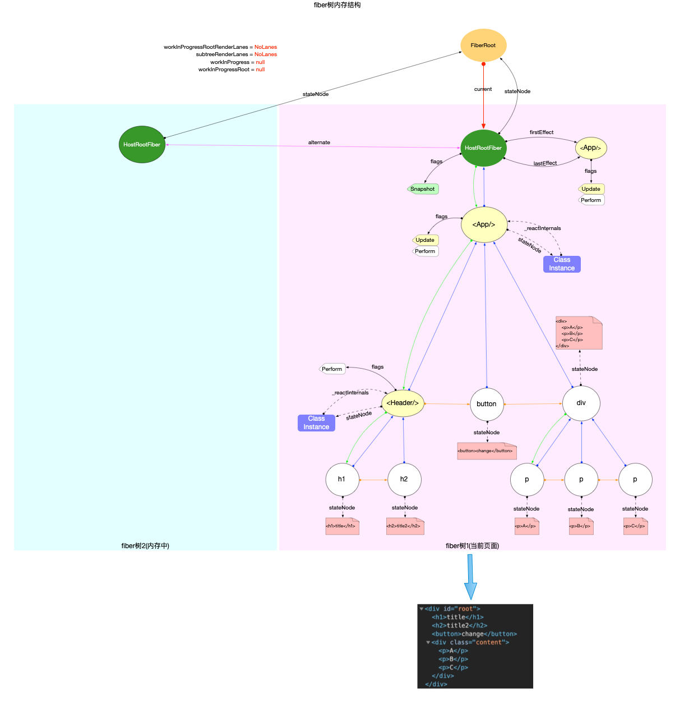

## 更新入口

前文[reconciler 运作流程](./reconciler-workflow.md#输入)中总结的 4 个阶段(从输入到输出), 其中承接输入的函数只有`scheduleUpdateOnFiber`([源码地址](https://github.com/facebook/react/blob/v17.0.2/packages/react-reconciler/src/ReactFiberWorkLoop.old.js#L517-L619)).在`react-reconciler`对外暴露的 api 函数中, 只要涉及到需要改变 fiber 的操作(无论是`首次渲染`或`对比更新`), 最后都会间接调用`scheduleUpdateOnFiber`, `scheduleUpdateOnFiber`函数是输入链路中的`必经之路`.

### 3 种更新方式

如要主动发起更新, 有 3 种常见方式:

1. `Class`组件中调用`setState`.
2. `Function`组件中调用`hook`对象暴露出的`dispatchAction`.
3. 在`container`节点上重复调用`render`([官网示例](https://reactjs.org/docs/rendering-elements.html#react-only-updates-whats-necessary))

下面列出这 3 种更新方式的源码:

#### setState

在`Component`对象的原型上挂载有`setState`([源码链接](https://github.com/facebook/react/blob/v17.0.2/packages/react/src/ReactBaseClasses.js#L57-L66)):

```js
Component.prototype.setState = function(partialState, callback) {
  this.updater.enqueueSetState(this, partialState, callback, 'setState');
};
```

在[fiber 树构造(初次创建)](./fibertree-create.md)中的`beginWork`阶段, class 类型的组件初始化完成之后, `this.updater`对象如下([源码链接](https://github.com/facebook/react/blob/v17.0.2/packages/react-reconciler/src/ReactFiberClassComponent.old.js#L193-L225)):

```js
const classComponentUpdater = {
  isMounted,
  enqueueSetState(inst, payload, callback) {
    // 1. 获取class实例对应的fiber节点
    const fiber = getInstance(inst);
    // 2. 创建update对象
    const eventTime = requestEventTime();
    const lane = requestUpdateLane(fiber); // 确定当前update对象的优先级
    const update = createUpdate(eventTime, lane);
    update.payload = payload;
    if (callback !== undefined && callback !== null) {
      update.callback = callback;
    }
    // 3. 将update对象添加到当前Fiber节点的updateQueue队列当中
    enqueueUpdate(fiber, update);
    // 4. 进入reconcier运作流程中的`输入`环节
    scheduleUpdateOnFiber(fiber, lane, eventTime); // 传入的lane是update优先级
  },
};
```

#### dispatchAction

> 此处只是为了对比`dispatchAction`和`setState`. 有关`hook`原理的深入分析, 在`hook 原理`章节中详细讨论.

在`function类型`组件中, 如果使用`hook(useState)`, 则可以通过`hook api`暴露出的`dispatchAction`([源码链接](https://github.com/facebook/react/blob/v17.0.2/packages/react-reconciler/src/ReactFiberHooks.old.js#L1645-L1753))来更新

```js
function dispatchAction<S, A>(
  fiber: Fiber,
  queue: UpdateQueue<S, A>,
  action: A,
) {
  // 1. 创建update对象
  const eventTime = requestEventTime();
  const lane = requestUpdateLane(fiber); // 确定当前update对象的优先级
  const update: Update<S, A> = {
    lane,
    action,
    eagerReducer: null,
    eagerState: null,
    next: (null: any),
  };
  // 2. 将update对象添加到当前Hook对象的updateQueue队列当中
  const pending = queue.pending;
  if (pending === null) {
    update.next = update;
  } else {
    update.next = pending.next;
    pending.next = update;
  }
  queue.pending = update;
  // 3. 请求调度, 进入reconcier运作流程中的`输入`环节.
  scheduleUpdateOnFiber(fiber, lane, eventTime); // 传入的lane是update优先级
}
```

#### 重复调用 render

```js
import ReactDOM from 'react-dom';
function tick() {
  const element = (
    <div>
      <h1>Hello, world!</h1>
      <h2>It is {new Date().toLocaleTimeString()}.</h2>
    </div>
  );
  ReactDOM.render(element, document.getElementById('root'));
}
setInterval(tick, 1000);
```

对于重复`render`, 在[React 应用的启动过程](./bootstrap.md)中已有说明, 调用路径包含`updateContainer-->scheduleUpdateOnFiber`

> 故无论从哪个入口进行更新, 最终都会进入`scheduleUpdateOnFiber`, 再次证明`scheduleUpdateOnFiber`是`输入`阶段的必经函数(参考[reconciler 运作流程](./reconciler-workflow.md)).

## 构造阶段

逻辑来到[scheduleUpdateOnFiber](https://github.com/facebook/react/blob/v17.0.2/packages/react-reconciler/src/ReactFiberWorkLoop.old.js#L517-L619)函数:

```js
// ...省略部分代码
export function scheduleUpdateOnFiber(
  fiber: Fiber, // fiber表示被更新的节点
  lane: Lane, // lane表示update优先级
  eventTime: number,
) {
  const root = markUpdateLaneFromFiberToRoot(fiber, lane);
  if (lane === SyncLane) {
    if (
      (executionContext & LegacyUnbatchedContext) !== NoContext &&
      (executionContext & (RenderContext | CommitContext)) === NoContext
    ) {
      // 初次渲染
      performSyncWorkOnRoot(root);
    } else {
      // 对比更新
      ensureRootIsScheduled(root, eventTime);
    }
  }
  mostRecentlyUpdatedRoot = root;
}
```

`对比更新`与`初次渲染`的不同点:

1. [markUpdateLaneFromFiberToRoot](https://github.com/facebook/react/blob/v17.0.2/packages/react-reconciler/src/ReactFiberWorkLoop.old.js#L625-L667)函数, 只在`对比更新`阶段才发挥出它的作用, 它找出了`fiber树`中受到本次`update`影响的所有节点, 并设置这些节点的`fiber.lanes`或`fiber.childLanes`(在`legacy`模式下为`SyncLane`)以备`fiber树构造`阶段使用.

```js
function markUpdateLaneFromFiberToRoot(
  sourceFiber: Fiber, // sourceFiber表示被更新的节点
  lane: Lane, // lane表示update优先级
): FiberRoot | null {
  // 1. 将update优先级设置到sourceFiber.lanes
  sourceFiber.lanes = mergeLanes(sourceFiber.lanes, lane);
  let alternate = sourceFiber.alternate;
  if (alternate !== null) {
    // 同时设置sourceFiber.alternate的优先级
    alternate.lanes = mergeLanes(alternate.lanes, lane);
  }
  // 2. 从sourceFiber开始, 向上遍历所有节点, 直到HostRoot. 设置沿途所有节点(包括alternate)的childLanes
  let node = sourceFiber;
  let parent = sourceFiber.return;
  while (parent !== null) {
    parent.childLanes = mergeLanes(parent.childLanes, lane);
    alternate = parent.alternate;
    if (alternate !== null) {
      alternate.childLanes = mergeLanes(alternate.childLanes, lane);
    }
    node = parent;
    parent = parent.return;
  }
  if (node.tag === HostRoot) {
    const root: FiberRoot = node.stateNode;
    return root;
  } else {
    return null;
  }
}
```

### markUpdateLaneFromFiberToRoot

下图表示了`markUpdateLaneFromFiberToRoot`的具体作用:

- 以`sourceFiber`为起点, 设置起点的`fiber.lanes`
- 从起点开始, 直到`HostRootFiber`, 设置父路径上所有节点(也包括`fiber.alternate`)的`fiber.childLanes`.
- 通过设置`fiber.lanes`和`fiber.childLanes`就可以辅助判断子树是否需要更新(在下文`循环构造`中详细说明).

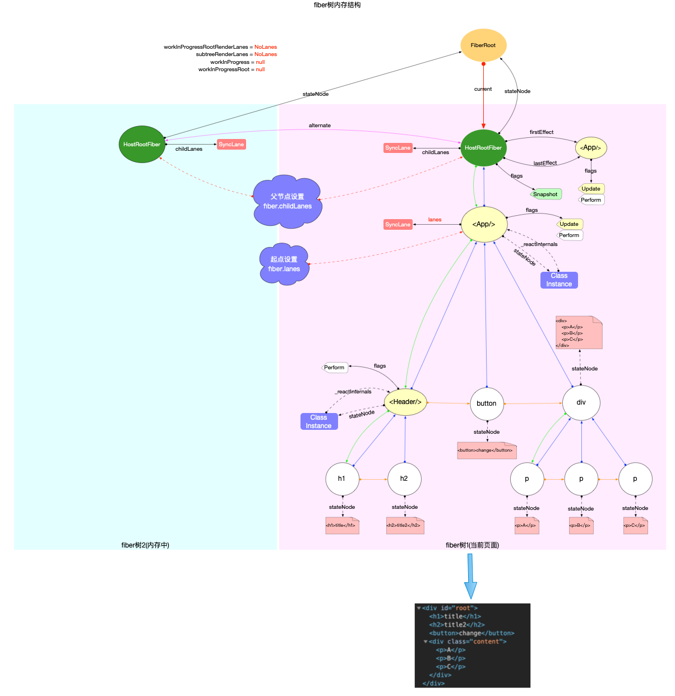

2. `对比更新`没有直接调用`performSyncWorkOnRoot`, 而是通过调度中心来处理, 由于本示例是在`Legacy`模式下进行, 最后会同步执行`performSyncWorkOnRoot`.(详细原理可以参考[React 调度原理(scheduler)](./scheduler.md)). 所以其调用链路`performSyncWorkOnRoot--->renderRootSync--->workLoopSync`与`初次构造`中的一致.

在[renderRootSync](https://github.com/facebook/react/blob/v17.0.2/packages/react-reconciler/src/ReactFiberWorkLoop.old.js#L1490-L1553)中:

```js
function renderRootSync(root: FiberRoot, lanes: Lanes) {
  const prevExecutionContext = executionContext;
  executionContext |= RenderContext;
  // 如果fiberRoot变动, 或者update.lane变动, 都会刷新栈帧, 丢弃上一次渲染进度
  if (workInProgressRoot !== root || workInProgressRootRenderLanes !== lanes) {
    // 刷新栈帧, legacy模式下都会进入
    prepareFreshStack(root, lanes);
  }
  do {
    try {
      workLoopSync();
      break;
    } catch (thrownValue) {
      handleError(root, thrownValue);
    }
  } while (true);
  executionContext = prevExecutionContext;
  // 重置全局变量, 表明render结束
  workInProgressRoot = null;
  workInProgressRootRenderLanes = NoLanes;
  return workInProgressRootExitStatus;
}
```

进入循环构造(`workLoopSync`)前, 会刷新栈帧(调用`prepareFreshStack`)(参考[fiber 树构造(基础准备)](./fibertree-prepare.md#栈帧管理)中`栈帧管理`).

此时的内存结构如下:

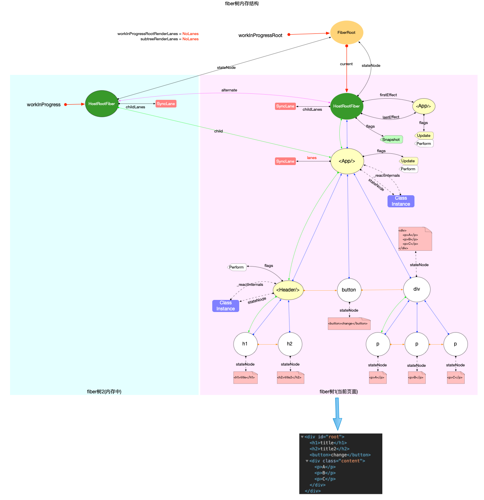

注意:

- `fiberRoot.current`指向与当前页面对应的`fiber树`, `workInProgress`指向正在构造的`fiber树`.
- 刷新栈帧会调用`createWorkInProgress()`, 使得`workInProgress.flags和workInProgress.effects`都已经被重置. 且`workInProgress.child = current.child`. 所以在进入`循环构造`之前, `HostRootFiber`与`HostRootFiber.alternate`共用一个`child`(这里是`fiber(<App/>)`).

### 循环构造

回顾一下[fiber 树构造(初次创建)](./fibertree-create.md)中的介绍. 整个`fiber树构造`是一个深度优先遍历(可参考[React 算法之深度优先遍历](../algorithm/dfs.md)), 其中有 2 个重要的变量`workInProgress`和`current`(可参考[fiber 树构造(基础准备)](./fibertree-prepare.md#双缓冲技术)中介绍的`双缓冲技术`):

- `workInProgress`和`current`都视为指针
- `workInProgress`指向当前正在构造的`fiber`节点
- `current = workInProgress.alternate`(即`fiber.alternate`), 指向当前页面正在使用的`fiber`节点.

在深度优先遍历中, 每个`fiber`节点都会经历 2 个阶段:

1. 探寻阶段 `beginWork`
2. 回溯阶段 `completeWork`

这 2 个阶段共同完成了每一个`fiber`节点的创建(或更新), 所有`fiber`节点则构成了`fiber树`.

```js
function workLoopSync() {
  while (workInProgress !== null) {
    performUnitOfWork(workInProgress);
  }
}

// ... 省略部分无关代码
function performUnitOfWork(unitOfWork: Fiber): void {
  // unitOfWork就是被传入的workInProgress
  const current = unitOfWork.alternate;
  let next;
  next = beginWork(current, unitOfWork, subtreeRenderLanes);
  unitOfWork.memoizedProps = unitOfWork.pendingProps;
  if (next === null) {
    // 如果没有派生出新的节点, 则进入completeWork阶段, 传入的是当前unitOfWork
    completeUnitOfWork(unitOfWork);
  } else {
    workInProgress = next;
  }
}
```

注意: 在`对比更新`过程中`current = unitOfWork.alternate;`不为`null`, 后续的调用逻辑中会大量使用此处传入的`current`.

### 探寻阶段 beginWork

`beginWork(current, unitOfWork, subtreeRenderLanes)`([源码地址](https://github.com/facebook/react/blob/v17.0.2/packages/react-reconciler/src/ReactFiberBeginWork.old.js#L3083-L3494)).

```js
function beginWork(
  current: Fiber | null,
  workInProgress: Fiber,
  renderLanes: Lanes,
): Fiber | null {
  const updateLanes = workInProgress.lanes;
  if (current !== null) {
    // 进入对比
    const oldProps = current.memoizedProps;
    const newProps = workInProgress.pendingProps;
    if (
      oldProps !== newProps ||
      hasLegacyContextChanged() ||
      (__DEV__ ? workInProgress.type !== current.type : false)
    ) {
      didReceiveUpdate = true;
    } else if (!includesSomeLane(renderLanes, updateLanes)) {
      // 当前渲染优先级renderLanes不包括fiber.lanes, 表明当前fiber节点无需更新
      didReceiveUpdate = false;
      switch (
        workInProgress.tag
        // switch 语句中包括 context相关逻辑, 本节暂不讨论(不影响分析fiber树构造)
      ) {
      }
      // 当前fiber节点无需更新, 调用bailoutOnAlreadyFinishedWork循环检测子节点是否需要更新
      return bailoutOnAlreadyFinishedWork(current, workInProgress, renderLanes);
    }
  }
  // 余下逻辑与初次创建共用
  // 1. 设置workInProgress优先级为NoLanes(最高优先级)
  workInProgress.lanes = NoLanes;
  // 2. 根据workInProgress节点的类型, 用不同的方法派生出子节点
  switch (
    workInProgress.tag // 只列出部分case
  ) {
    case ClassComponent: {
      const Component = workInProgress.type;
      const unresolvedProps = workInProgress.pendingProps;
      const resolvedProps =
        workInProgress.elementType === Component
          ? unresolvedProps
          : resolveDefaultProps(Component, unresolvedProps);
      return updateClassComponent(
        current,
        workInProgress,
        Component,
        resolvedProps,
        renderLanes,
      );
    }
    case HostRoot:
      return updateHostRoot(current, workInProgress, renderLanes);
    case HostComponent:
      return updateHostComponent(current, workInProgress, renderLanes);
    case HostText:
      return updateHostText(current, workInProgress);
    case Fragment:
      return updateFragment(current, workInProgress, renderLanes);
  }
}
```

#### `bailout`逻辑 {#bailout}

> `bail out`英文短语翻译为`解救, 纾困`, 在源码中, `bailout`用于判断子树节点是否完全复用, 如果可以复用, 则会略过 fiber 树构造.

与`初次创建`不同, 在`对比更新`过程中, 如果是`老节点`, 那么`current !== null`, 需要进行对比, 然后决定是否复用老节点及其子树(即`bailout`逻辑).

1. `!includesSomeLane(renderLanes, updateLanes)`这个判断分支, 包含了`渲染优先级`和`update优先级`的比较(详情可以回顾[fiber 树构造(基础准备)](./fibertree-prepare.md#优先级)中`优先级`相关解读), 如果当前节点无需更新, 则会进入`bailout`逻辑.
2. 最后会调用`bailoutOnAlreadyFinishedWork`:
   - 如果同时满足`!includesSomeLane(renderLanes, workInProgress.childLanes)`, 表明该 fiber 节点及其子树都无需更新, 可直接进入回溯阶段(`completeUnitofWork`)
   - 如果不满足`!includesSomeLane(renderLanes, workInProgress.childLanes)`, 意味着子节点需要更新, `clone`并返回子节点.

```js
// 省略部分无关代码
function bailoutOnAlreadyFinishedWork(
  current: Fiber | null,
  workInProgress: Fiber,
  renderLanes: Lanes,
): Fiber | null {
  if (!includesSomeLane(renderLanes, workInProgress.childLanes)) {
    // 渲染优先级不包括 workInProgress.childLanes, 表明子节点也无需更新. 返回null, 直接进入回溯阶段.
    return null;
  } else {
    // 本fiber虽然不用更新, 但是子节点需要更新. clone并返回子节点
    cloneChildFibers(current, workInProgress);
    return workInProgress.child;
  }
}
```

注意: `cloneChildFibers`内部调用`createWorkInProgress`, 在构造`fiber`节点时会优先复用`workInProgress.alternate`(不开辟新的内存空间), 否则才会创建新的`fiber`对象.

#### `updateXXX`函数

`updateXXX`函数(如: updateHostRoot, updateClassComponent 等)的主干逻辑与`初次构造`过程完全一致, 总的目的是为了向下生成子节点, 并在这个过程中调用`reconcileChildren`调和函数, 只要`fiber`节点有副作用, 就会把特殊操作设置到`fiber.flags`(如:`节点ref`,`class组件的生命周期`,`function组件的hook`,`节点删除`等).

`对比更新`过程的不同之处:

1. `bailoutOnAlreadyFinishedWork`
   - `对比更新`时如果遇到当前节点无需更新(如: `class`类型的节点且`shouldComponentUpdate`返回`false`), 会再次进入`bailout`逻辑.
2. `reconcileChildren`调和函数
   - 调和函数是`updateXXX`函数中的一项重要逻辑, 它的作用是向下生成子节点, 并设置`fiber.flags`.
   - `初次创建`时`fiber`节点没有比较对象, 所以在向下生成子节点的时候没有任何多余的逻辑, 只管创建就行.
   - `对比更新`时需要把`ReactElement`对象与`旧fiber`对象进行比较, 来判断是否需要复用`旧fiber`对象.

注: 本节的重点是`fiber树构造`, 在`对比更新`过程中`reconcileChildren()函数`实现的`diff`算法十分重要, 但是它只是处于算法层面, 对于`diff`算法的实现,在[React 算法之调和算法](../algorithm/diff.md)中单独分析.

本节只需要先了解调和函数目的:

1. 给新增,移动,和删除节点设置`fiber.flags`(新增,移动: `Placement`, 删除: `Deletion`)
2. 如果是需要删除的`fiber`, [除了自身打上`Deletion`之外, 还要将其添加到父节点的`effects`链表中](https://github.com/facebook/react/blob/v17.0.2/packages/react-reconciler/src/ReactChildFiber.old.js#L275-L294)(正常副作用队列的处理是在`completeWork`函数, 但是该节点(被删除)会脱离`fiber`树, 不会再进入`completeWork`阶段, 所以在`beginWork`阶段提前加入副作用队列).

### 回溯阶段 completeWork

`completeUnitOfWork(unitOfWork)函数`([源码地址](https://github.com/facebook/react/blob/v17.0.2/packages/react-reconciler/src/ReactFiberWorkLoop.old.js#L1670-L1802))在`初次创建`和`对比更新`逻辑一致, 都是处理`beginWork` 阶段已经创建出来的 `fiber` 节点, 最后创建(更新)DOM 对象, 并上移副作用队列.

在这里我们重点关注`completeWork`函数中, `current !== null`的情况:

```js
// ...省略无关代码
function completeWork(
  current: Fiber | null,
  workInProgress: Fiber,
  renderLanes: Lanes,
): Fiber | null {
  const newProps = workInProgress.pendingProps;
  switch (workInProgress.tag) {
    case HostComponent: {
      // 非文本节点
      popHostContext(workInProgress);
      const rootContainerInstance = getRootHostContainer();
      const type = workInProgress.type;
      if (current !== null && workInProgress.stateNode != null) {
        // 处理改动
        updateHostComponent(
          current,
          workInProgress,
          type,
          newProps,
          rootContainerInstance,
        );
        if (current.ref !== workInProgress.ref) {
          markRef(workInProgress);
        }
      } else {
        // ...省略无关代码
      }
      return null;
    }
    case HostText: {
      // 文本节点
      const newText = newProps;
      if (current && workInProgress.stateNode != null) {
        const oldText = current.memoizedProps;
        // 处理改动
        updateHostText(current, workInProgress, oldText, newText);
      } else {
        // ...省略无关代码
      }
      return null;
    }
  }
}
```

```js
updateHostComponent = function(
  current: Fiber,
  workInProgress: Fiber,
  type: Type,
  newProps: Props,
  rootContainerInstance: Container,
) {
  const oldProps = current.memoizedProps;
  if (oldProps === newProps) {
    return;
  }
  const instance: Instance = workInProgress.stateNode;
  const currentHostContext = getHostContext();
  const updatePayload = prepareUpdate(
    instance,
    type,
    oldProps,
    newProps,
    rootContainerInstance,
    currentHostContext,
  );
  workInProgress.updateQueue = (updatePayload: any);
  // 如果有属性变动, 设置fiber.flags |= Update, 等待`commit`阶段的处理
  if (updatePayload) {
    markUpdate(workInProgress);
  }
};
updateHostText = function(
  current: Fiber,
  workInProgress: Fiber,
  oldText: string,
  newText: string,
) {
  // 如果有属性变动, 设置fiber.flags |= Update, 等待`commit`阶段的处理
  if (oldText !== newText) {
    markUpdate(workInProgress);
  }
};
```

可以看到在更新过程中, 如果 DOM 属性有变化, 不会再次新建 DOM 对象, 而是设置`fiber.flags |= Update`, 等待`commit`阶段处理([源码链接](https://github.com/facebook/react/blob/v17.0.2/packages/react-reconciler/src/ReactFiberCompleteWork.old.js#L197-L248)).

### 过程图解

针对本节的示例代码, 将整个`fiber`树构造过程表示出来:

构造前:

在上文已经说明, 进入循环构造前会调用`prepareFreshStack`刷新栈帧, 在进入`fiber树构造`循环之前, 保持这这个初始化状态:

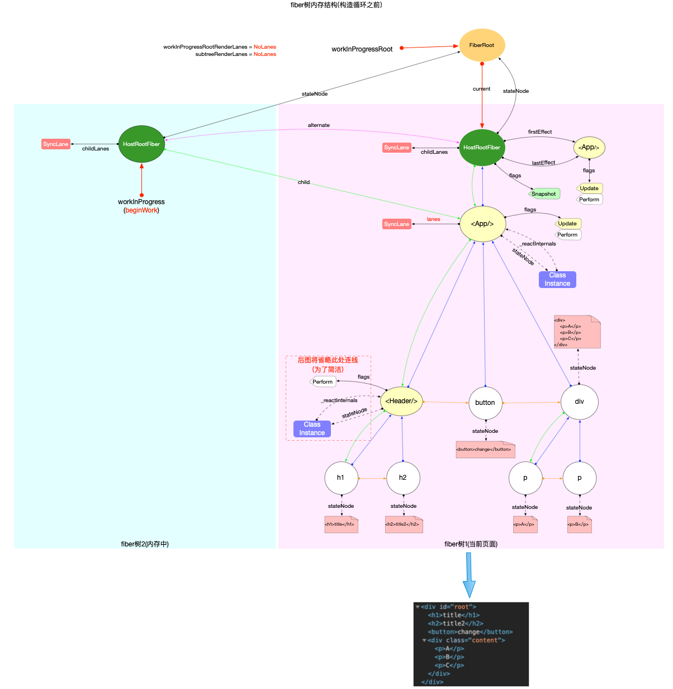

`performUnitOfWork`第 1 次调用(只执行`beginWork`):

- 执行前: `workInProgress`指向`HostRootFiber.alternate`对象, 此时`current = workInProgress.alternate`指向当前页面对应的`fiber`树.
- 执行过程:
  - 因为`current !== null`且当前节点`fiber.lanes`不在`渲染优先级`范围内, 故进入`bailoutOnAlreadyFinishedWork`逻辑
  - 又因为`fiber.childLanes`处于`渲染优先级`范围内, 证明`child`节点需要更新, 克隆`workInProgress.child`节点.
  - `clone`之后, `新fiber`节点会丢弃`旧fiber`上的标志位(`flags`)和副作用(`effects`), 其他属性会继续保留.
- 执行后: 返回被`clone`的下级节点`fiber(<App/>)`, 移动`workInProgress`指向子节点`fiber(<App/>)`

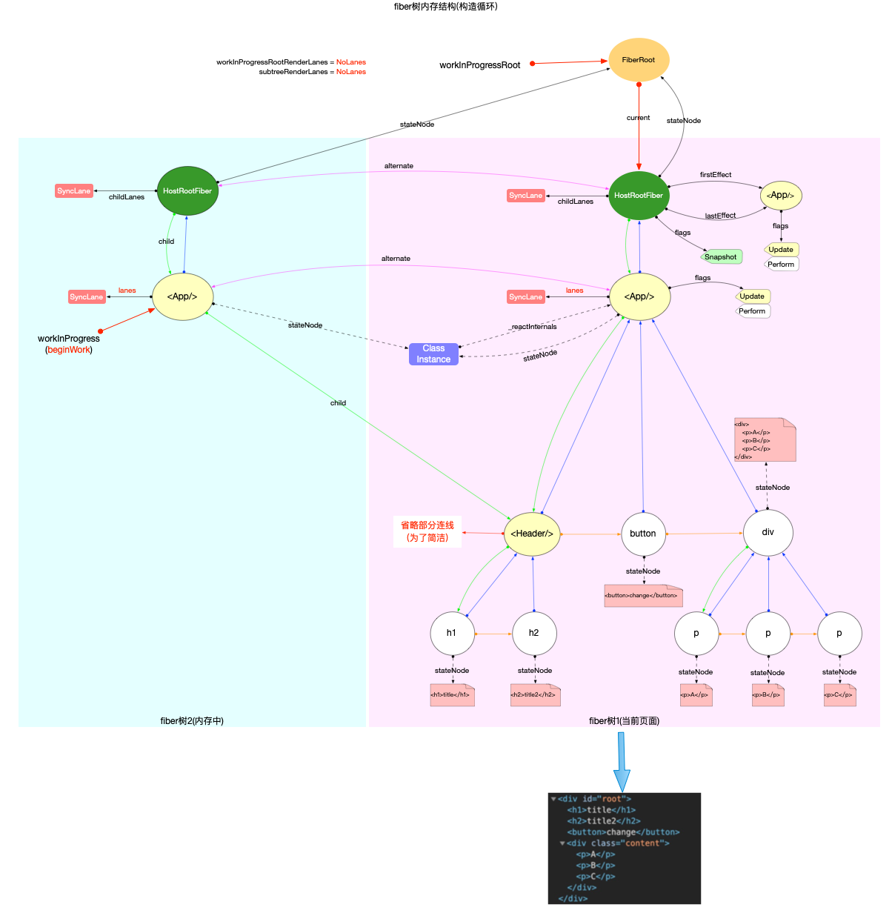

`performUnitOfWork`第 2 次调用(只执行`beginWork`):

- 执行前: `workInProgress`指向`fiber(<App/>)`节点, 且`current = workInProgress.alternate`有值
- 执行过程:
  - 当前节点`fiber.lanes`处于`渲染优先级`范围内, 会进入`updateClassComponent()`函数
  - 在`updateClassComponent()`函数中, 调用`reconcilerChildren()`生成下级子节点.
- 执行后: 返回下级节点`fiber(<Header/>)`, 移动`workInProgress`指向子节点`fiber(<Header/>)`

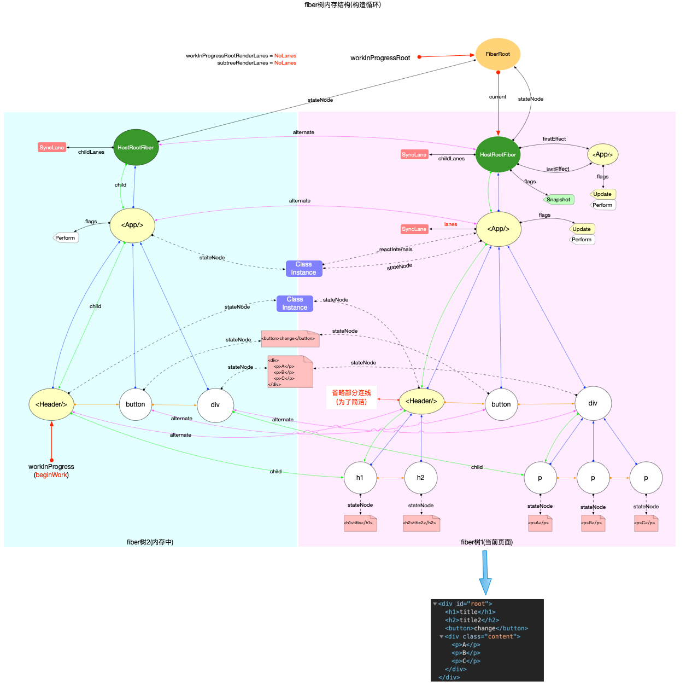

`performUnitOfWork`第 3 次调用(执行`beginWork`和`completeUnitOfWork`):

- `beginWork`执行前: `workInProgress`指向`fiber(<Header/>)`, 且`current = workInProgress.alternate`有值
- `beginWork`执行过程:
  - 当前节点`fiber.lanes`处于`渲染优先级`范围内, 会进入`updateClassComponent()`函数
  - 在`updateClassComponent()`函数中, 由于此组件是`PureComponent`, `shouldComponentUpdate`判定为`false`,故进入`bailoutOnAlreadyFinishedWork`逻辑.
  - 又因为`fiber.childLanes`不在`渲染优先级`范围内, 证明`child`节点也不需要更新
- `beginWork`执行后: 因为完全满足`bailout`逻辑, 返回`null`. 所以进入`completeUnitOfWork(unitOfWork)`函数, 传入的参数`unitOfWork`实际上就是`workInProgress`(此时指向`fiber(<Header/>)`)

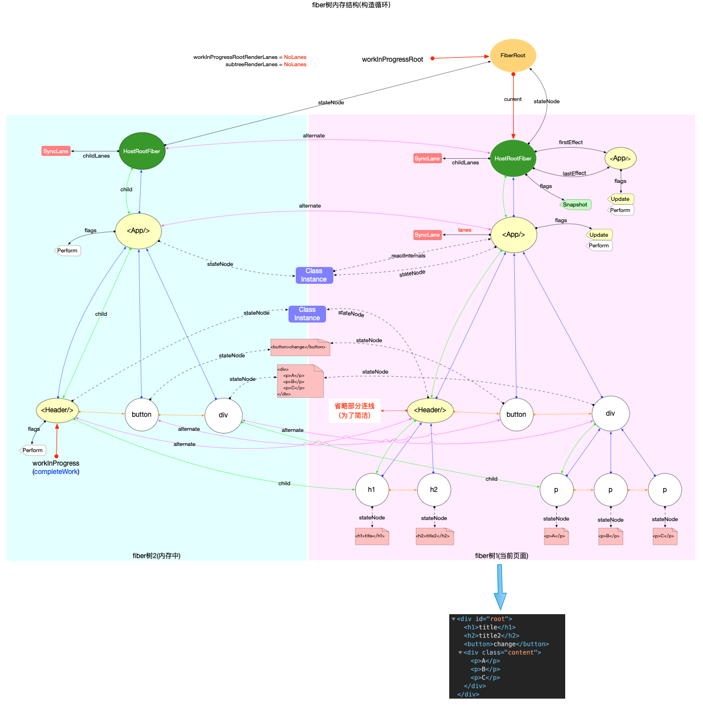

- `completeUnitOfWork`执行前: `workInProgress`指向`fiber(<Header/>)`
- `completeUnitOfWork`执行过程: 以`fiber(<Header/>)`为起点, 向上回溯

`completeUnitOfWork`第 1 次循环:

1.  执行`completeWork`函数: `class`类型的组件无需处理.
2.  上移副作用队列: 由于本节点`fiber(header)`没有副作用(`fiber.flags = 0`), 所以执行之后副作用队列没有实质变化(目前为空).
3.  向上回溯: 由于还有兄弟节点, 把`workInProgress`指向下一个兄弟节点`fiber(button)`, 退出`completeUnitOfWork`.

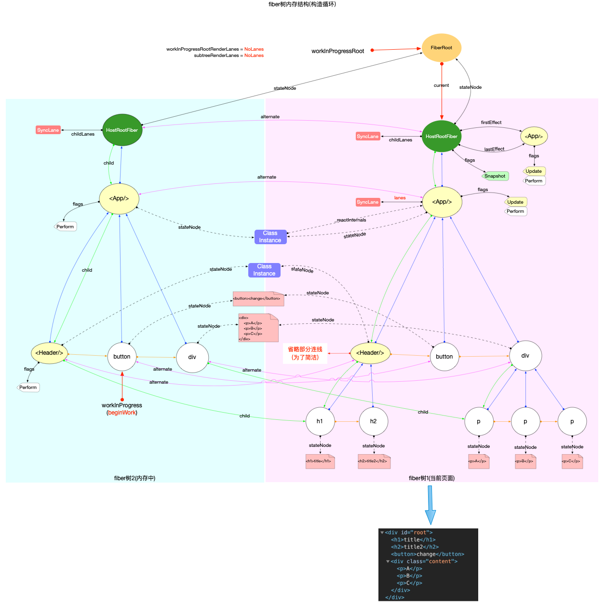

`performUnitOfWork`第 4 次调用(执行`beginWork`和`completeUnitOfWork`):

- `beginWork`执行过程: 调用`updateHostComponent`
  - 本示例中`button`的子节点是一个[直接文本节点](https://github.com/facebook/react/blob/8e5adfbd7e605bda9c5e96c10e015b3dc0df688e/packages/react-dom/src/client/ReactDOMHostConfig.js#L350-L361),设置[nextChildren = null](https://github.com/facebook/react/blob/v17.0.2/packages/react-reconciler/src/ReactFiberBeginWork.old.js#L1147)(源码注释的解释是不用在开辟内存去创建一个文本节点, 同时还能减少向下遍历).
  - 由于`nextChildren = null`, 经过`reconcilerChildren`阶段处理后, 返回值也是`null`
- `beginWork`执行后: 由于下级节点为`null`, 所以进入`completeUnitOfWork(unitOfWork)`函数, 传入的参数`unitOfWork`实际上就是`workInProgress`(此时指向`fiber(button)`节点)

- `completeUnitOfWork`执行过程: 以`fiber(button)`为起点, 向上回溯

`completeUnitOfWork`第 1 次循环:

1.  执行`completeWork`函数
    - 因为`fiber(button).stateNode != null`, 所以无需再次创建 DOM 对象. 只需要进一步调用`updateHostComponent()`记录 DOM 属性改动情况
    - 在`updateHostComponent()`函数中, 又因为`oldProps === newProps`, 所以无需记录改动情况, 直接返回
2.  上移副作用队列: 由于本节点`fiber(button)`没有副作用(`fiber.flags = 0`), 所以执行之后副作用队列没有实质变化(目前为空).
3.  向上回溯: 由于还有兄弟节点, 把`workInProgress`指向下一个兄弟节点`fiber(div)`, 退出`completeUnitOfWork`.


`performUnitOfWork`第 5 次调用(执行`beginWork`):

- 执行前: `workInProgress`指向`fiber(div)`节点, 且`current = workInProgress.alternate`有值
- 执行过程:
  - 在`updateHostComponent()`函数中, 调用`reconcilerChildren()`生成下级子节点.
  - 需要注意的是, 下级子节点是一个可迭代数组, 会把`fiber.child.sbling`一起构造出来, 同时根据需要设置`fiber.flags`. 在本例中, 下级节点有被删除的情况, 被删除的节点会被添加到父节点的副作用队列中(具体实现方式请参考[React 算法之调和算法](../algorithm/diff.md)).
- 执行后: 返回下级节点`fiber(p)`, 移动`workInProgress`指向子节点`fiber(p)`

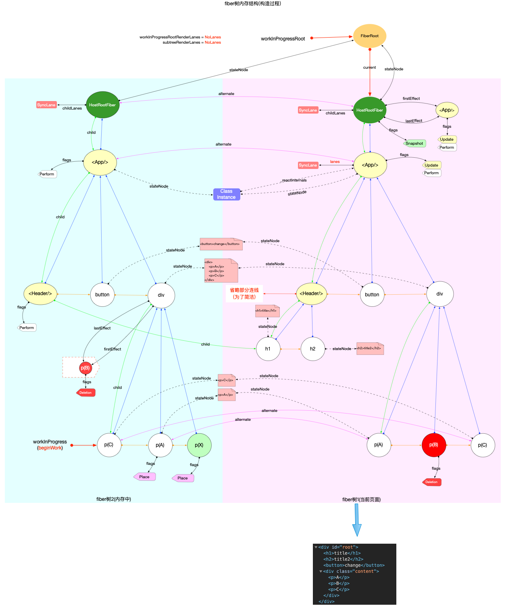

`performUnitOfWork`第 6 次调用(执行`beginWork`和`completeUnitOfWork`):

- `beginWork`执行过程: 与第 4 次调用中构建`fiber(button)`的逻辑完全一致, 因为都是直接文本节点, `reconcilerChildren()`返回的下级子节点为 null.
- `beginWork`执行后: 由于下级节点为`null`, 所以进入`completeUnitOfWork(unitOfWork)`函数

- `completeUnitOfWork`执行过程: 以`fiber(p)`为起点, 向上回溯

`completeUnitOfWork`第 1 次循环:

1.  执行`completeWork`函数
    - 因为`fiber(p).stateNode != null`, 所以无需再次创建 DOM 对象. 在`updateHostComponent()`函数中, 又因为节点属性没有变动, 所以无需打标记
2.  上移副作用队列: 本节点`fiber(p)`没有副作用(`fiber.flags = 0`).
3.  向上回溯: 由于还有兄弟节点, 把`workInProgress`指向下一个兄弟节点`fiber(p)`, 退出`completeUnitOfWork`.

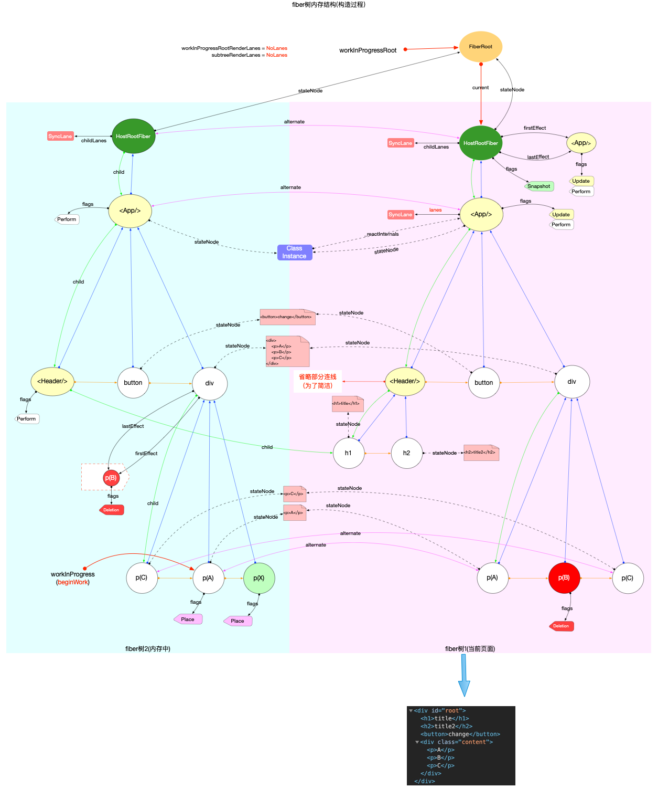

`performUnitOfWork`第 7 次调用(执行`beginWork`和`completeUnitOfWork`):

- `beginWork`执行过程: 与第 4 次调用中构建`fiber(button)`的逻辑完全一致, 因为都是直接文本节点, `reconcilerChildren()`返回的下级子节点为 null.
- `beginWork`执行后: 由于下级节点为`null`, 所以进入`completeUnitOfWork(unitOfWork)`函数

- `completeUnitOfWork`执行过程: 以`fiber(p)`为起点, 向上回溯

`completeUnitOfWork`第 1 次循环:

1.  执行`completeWork`函数:

    - 因为`fiber(p).stateNode != null`, 所以无需再次创建 DOM 对象. 在`updateHostComponent()`函数中, 又因为节点属性没有变动, 所以无需打标记

2.  上移副作用队列: 本节点`fiber(p)`有副作用(`fiber.flags = Placement`), 需要将其添加到父节点的副作用队列之后.
3.  向上回溯: 由于还有兄弟节点, 把`workInProgress`指向下一个兄弟节点`fiber(p)`, 退出`completeUnitOfWork`.

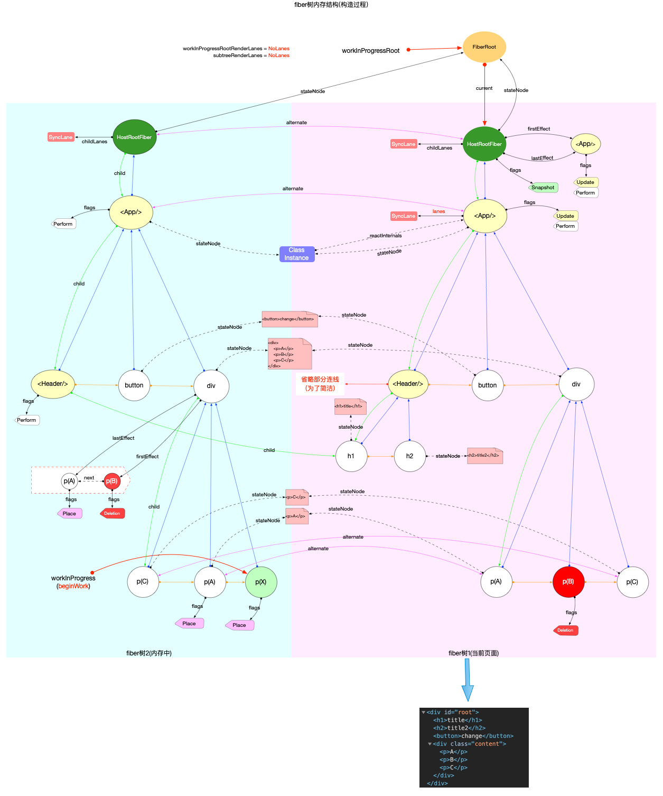

`performUnitOfWork`第 8 次调用(执行`beginWork`和`completeUnitOfWork`):

- `beginWork`执行过程: 本节点`fiber(p)`是一个新增节点, 其`current === null`, 会进入`updateHostComponent()`函数. 因为是直接文本节点, `reconcilerChildren()`返回的下级子节点为 null.
- `beginWork`执行后: 由于下级节点为`null`, 所以进入`completeUnitOfWork(unitOfWork)`函数

- `completeUnitOfWork`执行过程: 以`fiber(p)`为起点, 向上回溯

`completeUnitOfWork`第 1 次循环:

1.  执行`completeWork`函数: 由于本节点是一个新增节点,且`fiber(p).stateNode === null`, 所以创建`fiber(p)`节点对应的`DOM`实例, 挂载到`fiber.stateNode`之上.
2.  上移副作用队列: 本节点`fiber(p)`有副作用(`fiber.flags = Placement`), 需要将其添加到父节点的副作用队列之后.
3.  向上回溯: 由于没有兄弟节点, 把`workInProgress`指针指向父节点`fiber(div)`.

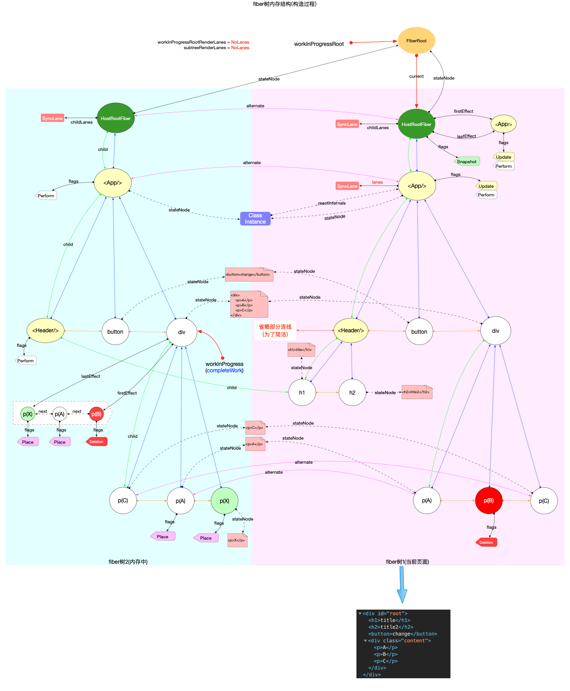

`completeUnitOfWork`第 2 次循环:

1.  执行`completeWork`函数: 由于`div`组件没有属性变动, 故`updateHostComponent()`没有设置副作用标记
2.  上移副作用队列: 本节点`fiber(div)`的副作用队列添加到父节点的副作用队列之后.
3.  向上回溯: 由于没有兄弟节点, 把`workInProgress`指针指向父节点`fiber(<App/>)`

`completeUnitOfWork`第 3 次循环:

1.  执行`completeWork`函数: class 类型的节点无需处理
2.  上移副作用队列: 本节点`fiber(<App/>)`的副作用队列添加到父节点的副作用队列之后.
3.  向上回溯: 由于没有兄弟节点, 把`workInProgress`指针指向父节点`fiber(HostRootFiber)`

`completeUnitOfWork`第 4 次循环:

1. 执行`completeWork`函数: `HostRoot`类型的节点无需处理
2. 向上回溯: 由于父节点为空, 无需进入处理副作用队列的逻辑. 最后设置`workInProgress=null`, 并退出`completeUnitOfWork`
3. 重置`fiber.childLanes`

到此整个`fiber树构造循环(对比更新)`已经执行完毕, 拥有一棵新的`fiber树`, 并且在`fiber树`的根节点上挂载了副作用队列. `renderRootSync`函数退出之前, 会重置`workInProgressRoot = null`, 表明没有正在进行中的`render`. 且把最新的`fiber树`挂载到`fiberRoot.finishedWork`上. 这时整个 fiber 树的内存结构如下(注意`fiberRoot.finishedWork`和`fiberRoot.current`指针,在`commitRoot`阶段会进行处理):

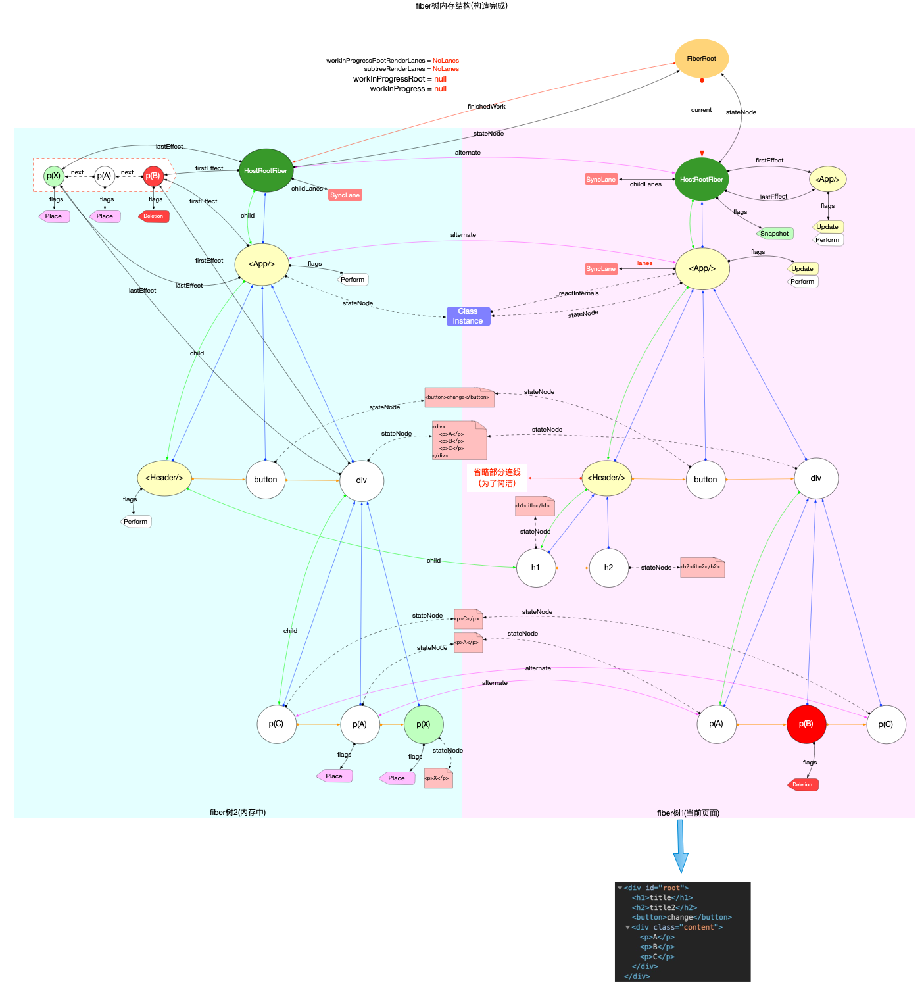

无论是`初次构造`或者是`对比更新`, 当`fiber树构造`完成之后, 余下的逻辑几乎一致, 在[fiber 树渲染](./fibertree-commit.md)中继续讨论.

## 总结

本节演示了更新阶段`fiber树构造(对比更新)`的全部过程, 跟踪了创建过程中内存引用的变化情况. 与`初次构造`最大的不同在于`fiber节点`是否可以复用, 其中`bailout`逻辑是`fiber子树`能否复用的判断依据.
